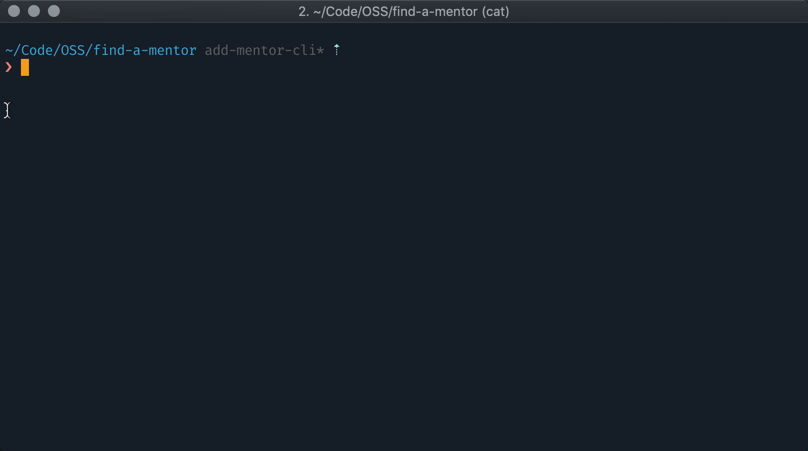

[](https://travis-ci.com/Coding-Coach/find-a-mentor)
[](https://github.com/Coding-Coach/find-a-mentor/issues)

Pre-release version of Coding Coach.

## Looking for a mentor?

Just go to https://mentors.codingcoach.io/ and find her / him / them.

## Requirements
- Git should be installed [Install Git](https://git-scm.com/downloads)
- Nodejs 11.6.0+ installed [Install Nodejs](https://nodejs.org/en/download/)
- Yarn (we recommend using yarn as a package manager) [Install Yarn](https://yarnpkg.com/en/)

## Want to be a mentor?

1. Fork
1. `yarn` (make sure you have a compatible node version, [nvm](https://github.com/creationix/nvm) or [fnm](https://github.com/Schniz/fnm#installation) can help here)

### CLI Geek?



1. `yarn run add-user`
1. Answer the questions.
1. Step 2 will push the required changes to a branch `add-{your-name}-as-mentor` so you just need to create a PR.

### Like to do it manually?
1. **Create a branch** "add-{your-name}-as-mentor"
1. Add your details in `src/mentors.json` file (check the below schema for requirements).
1. Run `yarn test` to validate that the details is following the right schema (carelfully read the output to see what needs to be fixed)
1. Push the "add-{your-name}-as-mentor" branch to github
1. PR with the title "Add {Your Name} as mentor".
1. Thanks!

**Notes:**

1. Please double check your details. It’s important that the data scheme remains the same; just replace the details with your values. If you change the data architecture, it will cause errors.
2. In order to avoid merge conflicts, please fetch the changes on master before pushing.

### Mentor schema

```javascript
{
  "id": "your email",
  "name": "your name",                          // minLength: 2
  "avatar": "https://link-to-your/avatar.jpg",  // url, must start with https://
  "title": "NodeJS developer",                  // minLength: 2, maxLength: 30
  "description": "Hi, I'm NodeJs developer",    // minLength: 5, maxLength: 80 optional
  "country": "Israel",                          // Full name. please avoid synonyms (check if it's not already exist)
  "tags": [                                     // minItems: 1, maxItems: 5
    "nodejs", "webpack", "mongodb"              // please avoid synonyms
  ],
  "channels": [                                 // minItems: 1, maxItems: 3
    {
      "type": "email",                          // see available channels below
      "id": "john@gmail.com"                    // depends on the type
    }
  ]
}
```

#### Channels

| type     | parameter                                                                                                               |
|----------|-------------------------------------------------------------------------------------------------------------------------|
| email    | email address                                                                                                           |
| slack    | memberID ([How to find it?](https://medium.com/@moshfeu/how-to-find-my-member-id-in-slack-workspace-d4bba942e38c#88b8)) |
| linkedin | userId                                                                                                                  |
| facebook | userId                                                                                                                  |
| twitter  | userId                                                                                                                  |

## Want to contribute this project?

That's why we here! 😀

Have an idea? Please **use a branch** and [create a PR](https://help.github.com/articles/creating-a-pull-request/). If you not sure how to do this, ask us or find a mentor who can assist.

Haven't time to code it? Please open an [issue](https://github.com/Coding-Coach/find-a-mentor/issues/new).

## Slack

Coding Coach is on Slack! [Click here](https://join.slack.com/t/coding-coach/shared_invite/enQtNTE2NDY4NTczNzE0LTMyOTAyZTFiYjE4OTUzYjgwYzk5MzlmYjgwNjUyNDZlZGY3NGVhYmU1NjdmZDQ3MmQ3YjRhYjJkMjM4OTYwNDA) to join.

---

This project was bootstrapped with [Create React App](https://github.com/facebook/create-react-app).

## Available Scripts

In the project directory, you can run:

### `yarn start`

Runs the app in the development mode.<br>
Open [http://localhost:3000](http://localhost:3000) to view it in the browser.

The page will reload if you make edits.<br>
You will also see any lint errors in the console.

### `yarn test`

Launches the test runner in the interactive watch mode.<br>
See the section about [running tests](https://facebook.github.io/create-react-app/docs/running-tests) for more information.
